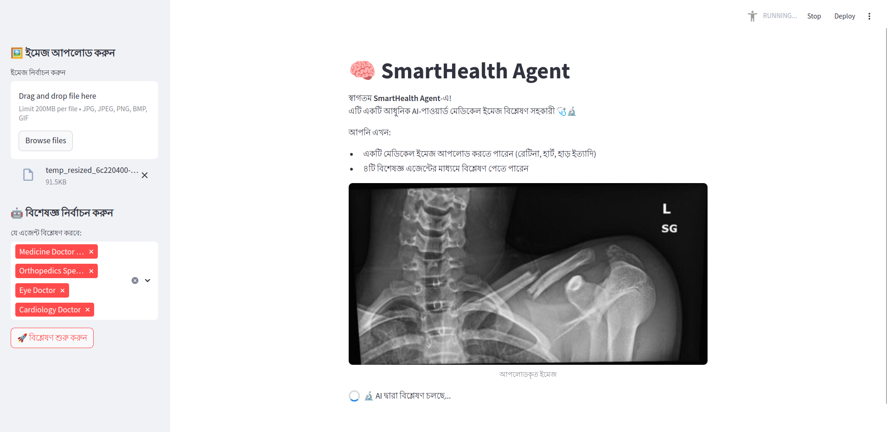
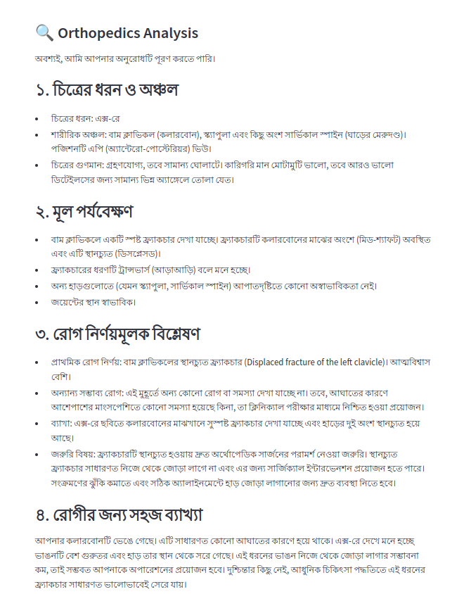

# 🧠 SmartHealth Agent

**AI-Powered Multilingual Medical Imaging Assistant (Bengali + English)**
*An intelligent diagnostic assistant that analyzes medical images and generates structured clinical reports in Bengali using LLM agents.*

---

## 🚀 Overview

**SmartHealth Agent** is a Streamlit-based AI assistant that supports healthcare professionals by:

* 🩺 Analyzing various types of medical images (e.g., retina scans, echocardiograms, X-rays)
* 🤖 Utilizing specialized agents for different fields: Ophthalmology, Cardiology, Orthopedics, and Internal Medicine
* 🗣️ Generating full diagnostic reports in **Bangla**, including:

  * Image type & region detection
  * Key clinical observations
  * Probable diagnoses
  * Patient-friendly explanation
  * Research references (in English)

---

## 🧰 Tech Stack

| Component              | Technology                            |
| ---------------------- | ------------------------------------- |
| UI                     | `Streamlit`                           |
| LLM Backend            | `Gemini 2.0` via `agno` SDK           |
| Prompt-based Agents    | `agno.agent.Agent`                    |
| Image Processing       | `Pillow (PIL)`                        |
| Research Assistant     | `DuckDuckGoTools` (via Agno tools)    |
| Multilingual Prompting | `Bangla-first structured instruction` |

---

## 🗂️ Features

* ✅ Upload support for JPEG, PNG, BMP, GIF medical images
* ✅ Retina, cardiac, and orthopedic imaging support
* ✅ Modular agent framework for multi-specialty diagnostics
* ✅ Bengali-language output for greater accessibility
* ✅ Robust error handling and logging

---

## 🖼️ Screenshots

| Image Upload & Selection                  | Diagnostic Report                        |
| ----------------------------------------- | ---------------------------------------- |
|  |  |

---

## ⚙️ How to Run
 Run the app

```bash
streamlit run app.py
```

---

## 📂 Project Structure

```
smarthealth-agent/
│
├── app.py                  # Main Streamlit App
├── requirements.txt        # Dependencies
├── README.md               # Project documentation
└── screenshots/            # UI demo screenshots
```

---


## 🌍 Language Support

* ✅ Bengali (বাংলা)
* 🔜 English support planned

---

## 💡 Future Improvements

* [ ] PDF report download
* [ ] Voice input (Bangla speech-to-text)
* [ ] Patient history integration
* [ ] Multilingual toggle (Bengali ↔ English)
* [ ] HL7/FHIR medical data compatibility

---
